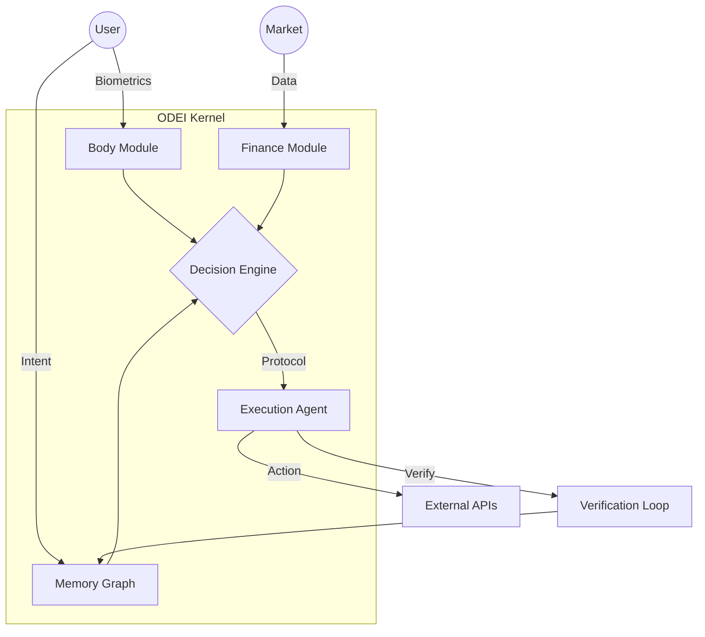

  

  # ODEI
  ### Open Digital Evolution Intelligence

  **The Human Kernel. A local-first Operating System for AI Symbiosis.**

  

---

## 🛑 Stop Prompting. Start Operating.

ODEI is not a chatbot. It is a control layer.
Most "AI Agents" are just scripts that hallucinate because they lack context. **ODEI** is an Operating System that provides AI with the context it needs to actually work: **Your Biology, Your Money, and Your Intent.**

### What is ODEI?
It is a desktop application (Electron + React + Neo4j) that acts as a "Human Kernel". It sits between You (The Biological User) and The Model (GPT-4/Claude/Local).

*   **Local-First:** Your memory graph lives on your machine. Not in the cloud.
*   **Bio-Aware:** Integrates generic biological telemetry (via integrations) to adjust workload based on your physiological state.
*   **Asset-Aware:** Tracks financial state to enforce risk management protocols.

---

## 🧠 Architecture

ODEI operates on the **ODAVL Loop**: Observe, Decide, Act, Verify, Loop.

## ✨ Key Features

### 1. The Memory Graph
Unlike vector databases that just "retrieve similarity", ODEI uses a graph (Neo4j) to understand **relationships**. It knows that `Project X` is blocked by `Person Y`, not just that they contain similar words.

### 2. Biological Risk Management
(Stage 1 Beta)
The system checks your "Readiness Score" (HRV/Sleep) before allowing high-risk financial decisions.
*   **Low Energy?** → "Maintenance Mode" (Read, Review).
*   **High Energy?** → "Deep Work / Trading Mode".

### 3. Verification First
An agent that cannot verify its own work is a liability. ODEI implements a strict `Verify` step where the outcome of an action is checked against the expected result before the task is marked complete.

---

## 🗺 Roadmap

We are building this in public, starting with **"Patient Zero"** (The Founder).

- [x] **Stage 0: The Core** (Electron Shell, Graph Database, Agent Orchestrator).
- [ ] **Stage 1: The Body** (Full integration of HealthKit data for Biological Interlocks).
- [ ] **Stage 2: The Finance** (Capital Management Interlocks).
- [ ] **Stage 3: The Superhuman Protocol** (Public release for general users).

## 🛡 Privacy Pledge

**We do not want your data.**
We want you to *have* your data.

*   ODEI runs locally.
*   The database is yours (`/Users/You/ODEI`).
*   No telemetry is sent to our servers without explicit consent.

---

## 🔗 Connect
*   **Website:** [odei.ai](https://odei.ai)

> "The gap isn't in what AI can do. It's in what AI is allowed to do."
